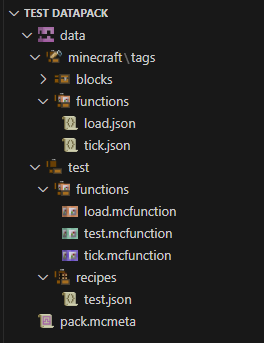
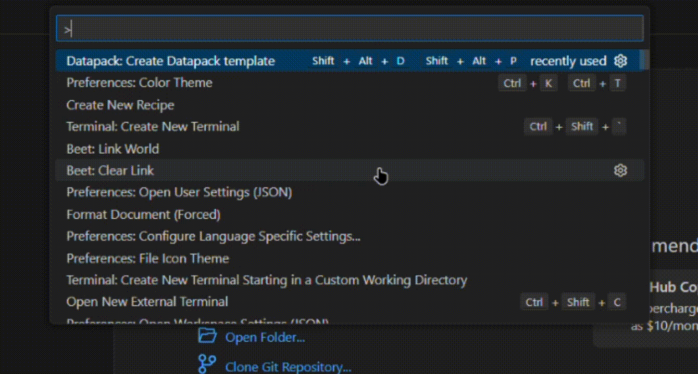
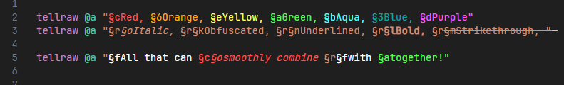
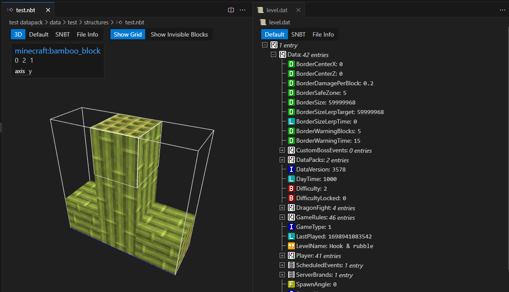
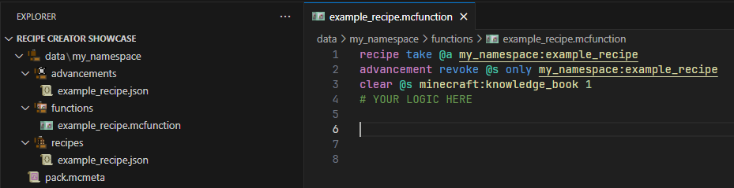

# What is datapack essentials?

It is something that allows you to unlock the ultimate minecraft coding experience with a single click!

# Extensions list

-   ## [mcfunction syntax highlight](https://marketplace.visualstudio.com/items?itemName=MinecraftCommands.syntax-mcfunction)

Highlights minecraft commands in .mcfunction file.

-   ## [datapack helper plus](https://marketplace.visualstudio.com/items?itemName=SPGoding.datapack-language-server)

This is a mcfunction LSP, provides autocompletion and error highlight.

-   ## [datapack icons](https://marketplace.visualstudio.com/items?itemName=SuperAnt.mc-dp-icons)

Minecraft styled icon theme for datapacks & resourcepacks.

-   ## [datapack utility](https://marketplace.visualstudio.com/items?itemName=ChenCMD.mc-datapack-utility)

Create an empty datapack in 10 seconds. Highly customizable! Add functions, advancements or any other datapack file. You can create your very own template as well!

-   ## [color highlighter](https://marketplace.visualstudio.com/items?itemName=nobuwu.mc-color)

Will highlight minecraft color codes, a very useful extension.

-   ## [tellraw preview](https://marketplace.visualstudio.com/items?itemName=actuallyboomber.tellraw-preview)

Shows a preview of how tellraw would look like. Useful, especially with long tellraws. Allows you to spot missing or extra whitespaces.

-   ## [nbt viewer](https://marketplace.visualstudio.com/items?itemName=Misodee.vscode-nbt)

Well, the name says it. Open `.nbt` and `.dat` files & inspect structures in 3D viewer.

-   ## [recipe creator](https://marketplace.visualstudio.com/items?itemName=ratquaza.recipe-creator)

Setup a basic NBT craft workaround with knowledge book in seconds.

#

### GitHub

https://github.com/amawdiin/dpc-pack

### Me

-   Discord: amandin
-   Telegram: amwndin
-   Github: https://github.com/amawdiin/

**Enjoy the pack!**
