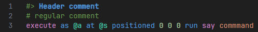
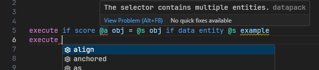
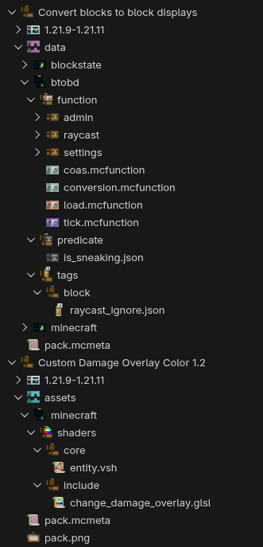
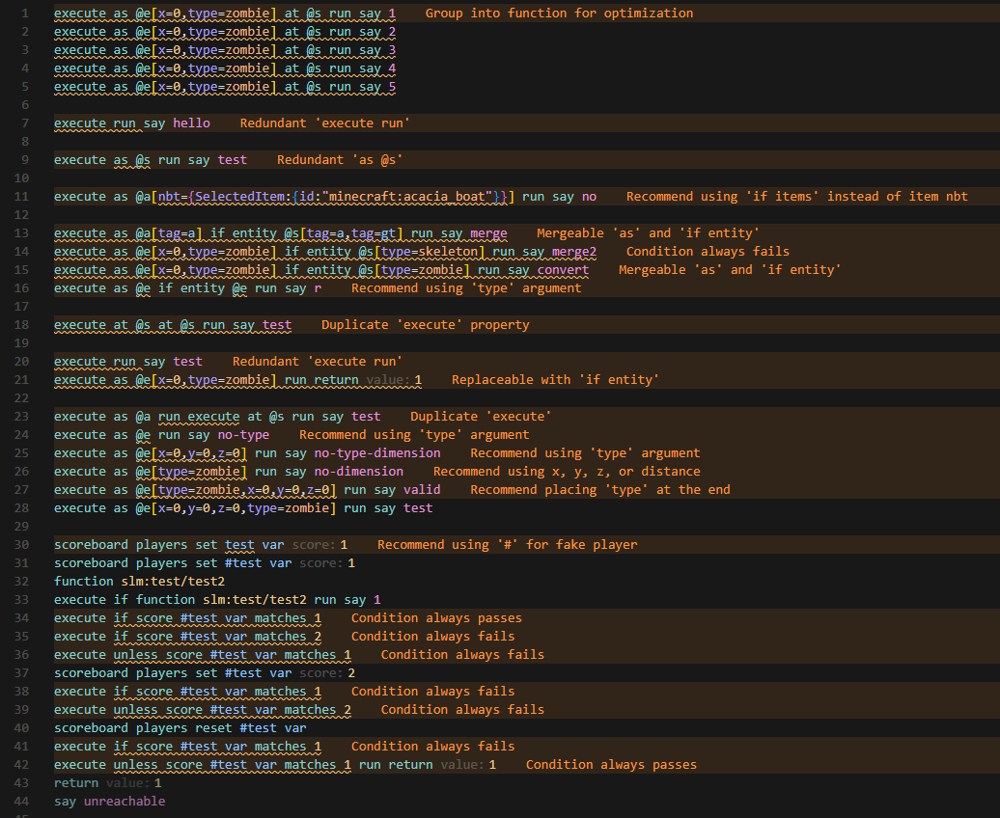
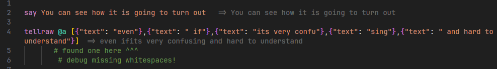

# What is datapack essentials?

It is something that allows you to unlock the ultimate minecraft coding experience with a single click!

# Extensions list

## [mcfunction syntax highlight](https://marketplace.visualstudio.com/items?itemName=MinecraftCommands.syntax-mcfunction)

Highlights minecraft commands in .mcfunction file.

## [spyglass](https://marketplace.visualstudio.com/items?itemName=SPGoding.datapack-language-server)

This is the mcfunction LSP, provides autocompletion, code diagnostics, symbol references, refactoring features.

## [datapack icons](https://marketplace.visualstudio.com/items?itemName=SuperAnt.mc-dp-icons)

Minecraft styled icon theme for datapacks & resourcepacks.

## [datapack optimization helper](https://marketplace.visualstudio.com/items?itemName=TheSalt.datapack-optimization)

Helps you optimize your datapack by pointing at weak points in your code

## [datapack utility](https://marketplace.visualstudio.com/items?itemName=ChenCMD.mc-datapack-utility)

Create an empty datapack in 10 seconds. Highly customizable! Add functions, advancements or any other datapack file. You can create your very own template as well!

## [worldgen tools](https://marketplace.visualstudio.com/items?itemName=Misodee.worldgen-tools)

Visualize noise and density function of worldgen.

## [nbt viewer](https://marketplace.visualstudio.com/items?itemName=Misodee.vscode-nbt)

Well, the name says it. Open `.nbt` and `.dat` files & inspect structures in 3D viewer.

## [recipe creator](https://marketplace.visualstudio.com/items?itemName=ratquaza.recipe-creator)

Setup a basic NBT craft workaround with knowledge book in seconds.

## [tellraw preview](https://marketplace.visualstudio.com/items?itemName=actuallyboomber.tellraw-preview)

Shows a preview of how tellraw would look like. Useful, especially with long tellraws. Allows you to spot missing or extra whitespaces.

